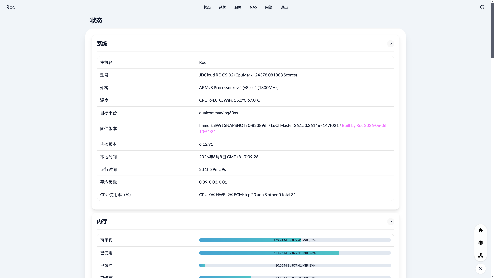

<h1>OpenWrt 云编译</h1>

## 特别提示

- **本人不对任何人因使用本固件所遭受的任何理论或实际损失承担责任。**
- **本固件禁止用于任何商业用途，请严格遵守所在地法律法规。**

## 项目说明

- 固件源码使用 [ImmortalWrt](https://github.com/immortalwrt/immortalwrt) 和 [LibWrt](https://github.com/LiBwrt/LibWrt) 上游仓库。
- 默认管理地址：**`[IP]`**，默认用户：**`root`**，默认密码：**`none`**。
- 固件仅额外选择 WireGuard、Argon、BanIP、DDNS/Cloudflare、Tailscale、dmesg、htop 和 nano。
- OpenWrt 为系统启动、LuCI、网络功能和目标设备自动选择的基础包及依赖不会被移除。
- Argon 使用作者 [jerrykuku](https://github.com/jerrykuku) 的官方仓库，其余目标软件使用 OpenWrt/ImmortalWrt/LibWrt 官方 feeds。

## 定制固件

- 修改 `configs` 目录中的目标配置文件，或上传自己的 `xx.config` 配置文件。
- `configs/General.config` 是所有固件共用的附加软件清单。
- 不需要的软件包应删除对应 `CONFIG_PACKAGE_*` 行或设为 `n`，只在行首添加 `#` 不会覆盖上游默认值。
- 在 GitHub Actions 中运行对应的固件 workflow；编译产物发布到当前仓库的 Releases。

## 单独编译软件包

- `Build-Packages` 只提供 `wireguard`、`argon`、`banip`、`ddns`、`tailscale`、`dmesg`、`htop` 和 `nano` 八个分组，`ALL` 表示全部目标分组。
- `sdk_version` 支持 `main`、`23.05`、`24.10`、`25.12` 或 `ALL`，SDK 从 [OpenWrt Downloads](https://downloads.openwrt.org/) 获取。
- x86-64 使用 `configs/x86-64.config + configs/Packages.config`；aarch64 根据 SDK 版本使用 qualcommax/ipq60xx 或 mediatek/filogic 目标配置。
- 编译产物按 `<SDK>-<软件包>-<架构>.zip` 分组并上传到 Artifacts 和 `Packages` Release；Argon 是通用架构包，`arch=ALL` 时只保留一份。

## 页面预览

